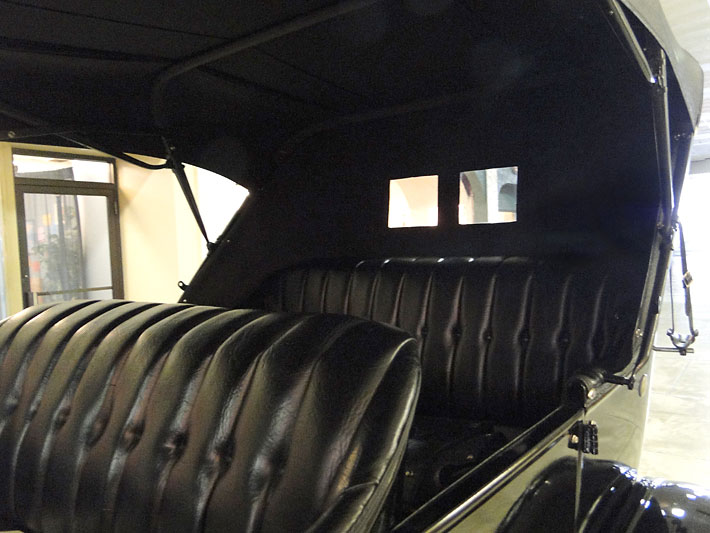

title: Sex, Violence, and Automobiles
style: style.css
output: sex-and-violence.html
controls: false

--

# Sex and Violence
## and Automobiles!

--

# Sex

## How cars changed the hot and heavy

--

### The Landscape

* Cars ownership among the dating population cropped up around the 1920's
* Sex was already becoming a public issue
* Dating, in its current incarnation, began around this time
* Cars drastically altered courtship rituals and dating culture

--

### Sex (generally) starts with dating
##### Cars made courtship easier and more intimate

* Traveling farther away meant having a greater degree of privacy
* A larger range of dating activities were then available
* The ability for a parent to supervise courtship was very greatly diminished.

--

### Dating Differences
* Dating  transitioned from women inviting men to court them to primarily males calling on women they liked
* Dating became about activities, flashier, spending money.
* Our normal dating life today was the start of their very, very adventurous dating life.

--

### Save the date
##### Because dating was new, and exciting. You could now go to:

* Restaurants
* A drive around and see sights
* Anywhere not in the immediate area
* ___THE BACK SEAT___

--

### On Privacy

* More (and better) roads allowed couples to go farther and to more places, in general (for longer than just an afternoon)
* Cars had steadily become more comfortable to park and stay inside, with their new uphostery and more ergonomic design.
   * ___THE BACK SEAT___ of a car was a relatively private place.

--

### There's so much room for activities!

--

### Sex Crimes
> "Of the thirty girls charged with 'sex crimes' before the juvenile court in the year prior to September 1st, 1924, nineteen committed the offence in an automobile, while the remaining eleven declined to say."

__via http://www.historytoday.com/peter-ling/sex-and-automobile-jazz-age__

Sexual liberation was happening, and the car gave the privacy, the place, and the freedom to help it on its way.

--

### On Men: A Self-Enforcing Circle
##### Cars helped reinforce masculinity

* For financial reasons, men were the primary vehicle owners.
* This helped lock cars in as part of the male identity
* A car allowed a man access to a larger and higher class dating pool.
* Helped identify a man as a "made man" -- someone with his life together.

--

### Autonomy
###### Not just a pun; cars allowed couples to be more autonomous.

* Couples were able to move farther away from the home and still maintain looser ties towards their family
* You could do more for running a shop, farm, or business than you could without one.
* Helped set the precedent that couples were their own unit, not just an extension of their original families.

--

### Today
##### Nothing ever changes

* At this point, researching 'sex' and 'automobile' together brings you to many lists of cars that are most enjoyable to have sex in.
* Ownership of a car has become heavily tied into the concept of manliness
* Mechaphilia.

--

# Violence
## Who rules the road?

--

### Jaywalking: A colorful history

1910s - 1920s: **Scenario**

* Children are getting hit by cars
* Mothers are freaking out
* *Who is to blame?*
* *Think of the children!*

--

### Jaywalking: A colorful history

Before this time, **people** owned the streets.

We walked there, played there, made it an extension of our property.

So when cars came by, we didn't move.

--

### Jaywalking: A colorful history

So we end up with this mess.

--

### Jaywalking: Early Days

**PEDESTRIANS**

* *Get out of here ya damn joyriders!*

**MOTORISTS**

* *This is our turf, **pedestrians**!*

The motorists didn't have much power behind them -- except...

--

<!-- engine picture -->

--

### Jaywalking: Darwinism

The roads became *survival of the fittest*.

> Pedestrians (and bicyclists) cited custom to claim prior rights,
> but custom could rarely withstand motorists’ superior power and speed.

As motorists found out, engines weren't enough.

> To secure an urban future for the car, they would have to win a legitimate
> place for it in the street and cast doubt on the legitimacy of those who
> stood in the way.

--

### Jaywalking: Resistance is Futile

**SPEED LIMITS**

Low speed limits were near impossible to enforce.

**GOVERNORS**

25mph - engine shuts off. Voters didn't like the idea.

**MORE VISIBLE TRAFFIC LINES/SIGNS**

No one cared.

--

### Jaywalking: Resistance is Futile

"Conditions have changed!"

--

<!-- first card -->

--

<!-- second card -->

--

### Jaywalking: War of the Words

1920 - Charles Hayes

* Less attention to *reckless drivers* and more attention to *Jay Walkers*.

1924 - Coroner Oscar Wolff and Police Chief Morgan Collins

* War on speed!
* Save the children!
* Give the pedestrians a chance!

--

### Jaywalking: The term as we know it

* **1913** - Syracuse's pioneering safety campaign
* **1917** - Boston's definition of the word
* **1918** - St. Louis leaflet distribution
* **1920** - San Francisco enters the conversation
* **1921** - Boy Scouts of America issues cards
* **1924** - Term added to the dictionary

*Jaywalking* became part of the vernacular.

--

### Jaywalking: Legacy

The acceptance of the term "jaywalking" was instrumental in educating the
public on its dangers.

Motorists finally had something substantial to work with.

The pesky pedestrians were finally put in their place.

--

<!-- shared space 1 -->

--

<!-- shared space 2 -->

--

<!-- shared space 3 -->
