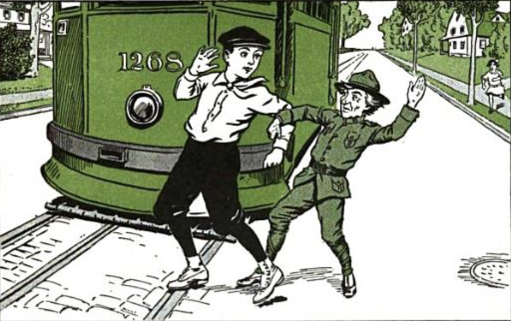

title: Sex, Violence, and Automobiles
style: style.css
output: sex-and-violence.html
controls: false

--

# Sex and Violence
## and Automobiles!

--

### Dating

* Cars drastically altered courtship and dating culture
* Cars made dating an easier and more intimate procedure
    * Traveling farther away meant having more privacy
    * Opened up a larger range of dating activities
    * Parental supervision became a thing of the past

--

### On Privacy

* Better road infrastructure = easier time traveling to safe places.
* Cars had steadily become more comfortable to stay in with the advent of new uphostery and better design.

--

### Dating Differences
* Dating had transitioned from women inviting men to court them to primarily males calling on women they liked

--

### On Men
* For financial reasons, men were the primary vehicle owners.
* This helped lock cars in as part of the male identity
* A car allowed a man access to a larger and higher class dating pool.

--

### On Indepdence

* A car allowed couples a greater degree of freedom
    * Could go to more locations
    * Could spend more time away from families

--

### Today

* At this point, researching 'sex' and 'automobile' together brings you
to many lists of cars that are most enjoyable to have sex in.
* Ownership of a car has become heavily tied into the concept of manliness

--

### References

* http://www.historytoday.com/peter-ling/sex-and-automobile-jazz-age
* "The Automobile Age" by James J. Flink

--

# Violence
## Who rules the road?

--

### Jaywalking: A colorful history

1910s - 1920s: **Scenario**

* Children are getting hit by cars
* Mothers are freaking out
* *Who is to blame?*
* *Think of the children!*

--

### Jaywalking: A colorful history

Before this time, **people** owned the streets.

We walked there, played there, made it an extension of our property.

So when cars came by, we didn't move.

--

### Jaywalking: A colorful history

So we end up with this mess.

--

### Jaywalking: Early Days

**PEDESTRIANS**

* *Get out of here ya damn joyriders!*

**MOTORISTS**

* *This is our turf, **pedestrians**!*

The motorists didn't have much power behind them -- except...

--

<!-- engine picture -->

--

### Jaywalking: Darwinism

The roads became *survival of the fittest*.

> Pedestrians (and bicyclists) cited custom to claim prior rights,
> but custom could rarely withstand motorists’ superior power and speed.

As motorists found out, engines weren't enough.

> To secure an urban future for the car, they would have to win a legitimate
> place for it in the street and cast doubt on the legitimacy of those who
> stood in the way.

--

### Jaywalking: Resistance is Futile

**SPEED LIMITS**

Low speed limits were near impossible to enforce.

**GOVERNORS**

25mph - engine shuts off. Voters didn't like the idea.

**MORE VISIBLE TRAFFIC LINES/SIGNS**

No one cared.

--

### Jaywalking: Resistance is Futile

"Conditions have changed!"

--

<!-- first card -->

--

<!-- second card -->

--

### Jaywalking: War of the Words

1920 - Charles Hayes

* Less attention to *reckless drivers* and more attention to *Jay Walkers*.

1924 - Coroner Oscar Wolff and Police Chief Morgan Collins

* War on speed!
* Save the children!
* Give the pedestrians a chance!

--

### Jaywalking: The term as we know it

* **1913** - Syracuse's pioneering safety campaign
* **1917** - Boston's definition of the word
* **1918** - St. Louis leaflet distribution
* **1920** - San Francisco enters the conversation
* **1921** - Boy Scouts of America issues cards
* **1924** - Term added to the dictionary

*Jaywalking* became part of the vernacular.

--

### Jaywalking: Legacy

The acceptance of the term "jaywalking" was instrumental in educating the
public on its dangers.

Motorists finally had something substantial to work with.

The pesky pedestrians were finally put in their place.

--

<!-- shared space 1 -->

--

<!-- shared space 2 -->

--

<!-- shared space 3 -->
